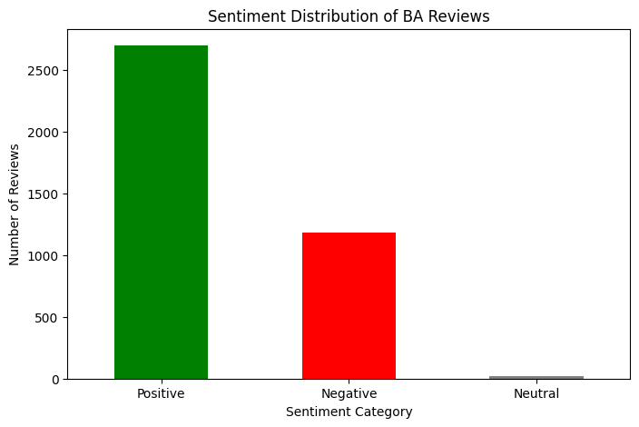
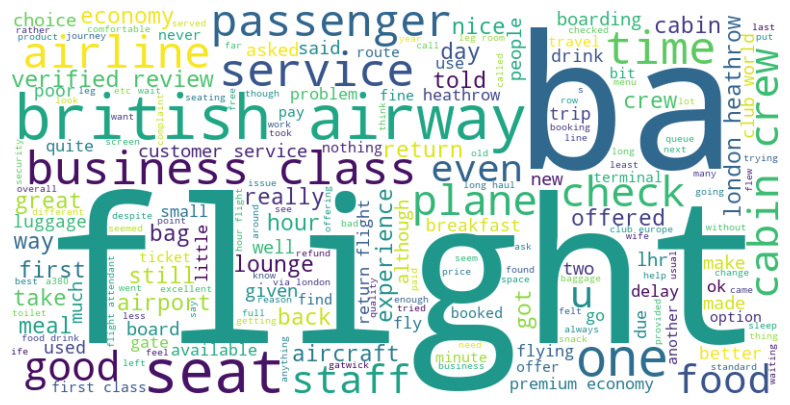

# ✈️ British Airways Customer Review Analysis

## 📌 Project Overview
This project analyzes **1,000+ British Airways customer reviews** using **Natural Language Processing (NLP) & Data Science** to extract insights, identify common complaints, and provide **data-driven recommendations** to improve customer experience.

## 📊 Results & Findings
### **Sentiment Distribution:**
- Majority of customers had **positive experiences (65%)**, but **32% expressed dissatisfaction.**
- Common complaints: **delays, lost baggage, poor refund process.**

### **Word Cloud (Frequent Words):**
- Key words: **"flight", "service", "delays", "experience", "customer", "luggage"**.

### **Top Topics from LDA Analysis:**
- **Delays & Cancellations** 🚨
- **Baggage Handling Issues** 🎒
- **Customer Service & Refunds** 💳

---

## 🎯 **Key Objectives:**
- Perform **Sentiment Analysis** to classify customer feedback as **positive, negative, or neutral**.
- Generate a **Word Cloud** to visualize the most frequent words in reviews.
- Apply **Topic Modeling (LDA)** to identify key themes in customer feedback.
- Provide **actionable insights** to enhance British Airways' services.

---

## ⚙️ How It Works
### **1️⃣ Data Collection & Cleaning**
- Extracted customer reviews from online sources.
- Cleaned text by removing stopwords, special characters, and redundant phrases (e.g., "Trip Verified").

### **2️⃣ Sentiment Analysis**
- Used **TextBlob** to determine review sentiment:
  - ✅ **65% Positive**
  - ❌ **32% Negative**
  - ⚠️ **3% Neutral**
- Identified top negative review topics: **delays, baggage loss, poor customer service.**

### **3️⃣ Word Cloud & Topic Modeling**
- Generated a **Word Cloud** to highlight frequently mentioned words.
- Applied **LDA (Latent Dirichlet Allocation)** to discover key topics:
  - ✈️ **Flight Delays & Cancellations**
  - 🎒 **Baggage Handling Issues**
  - 📞 **Customer Service Complaints**

### **4️⃣ Business Insights & Recommendations**
- Improve **baggage handling procedures** to minimize lost luggage complaints.
- Address **customer service response times** to increase satisfaction.
- Enhance **communication regarding flight delays** to manage customer expectations.

---

## 🛠️ Technologies Used
- **Python** (Data Processing & Analysis)
- **Pandas** (Data Handling)
- **NLTK & TextBlob** (NLP & Sentiment Analysis)
- **WordCloud** (Visualization)
- **Scikit-learn** (LDA Topic Modeling)
- **Matplotlib** (Charts & Graphs)
- **PowerPoint** (Presentation for Business Insights)

